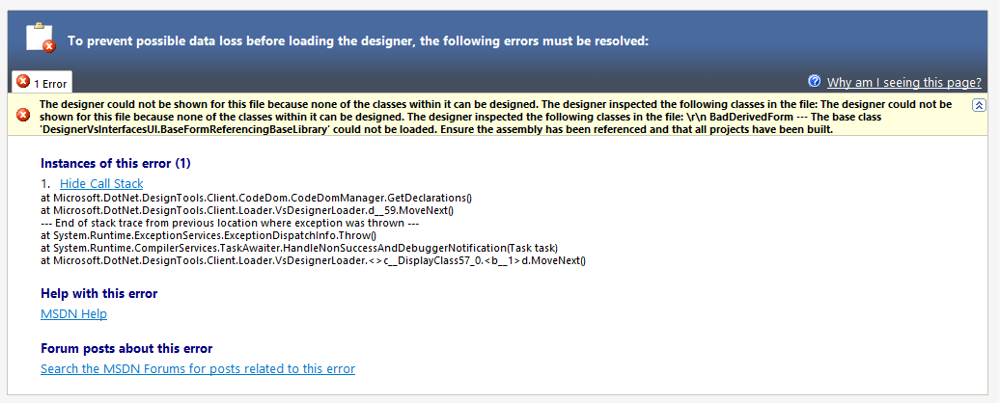
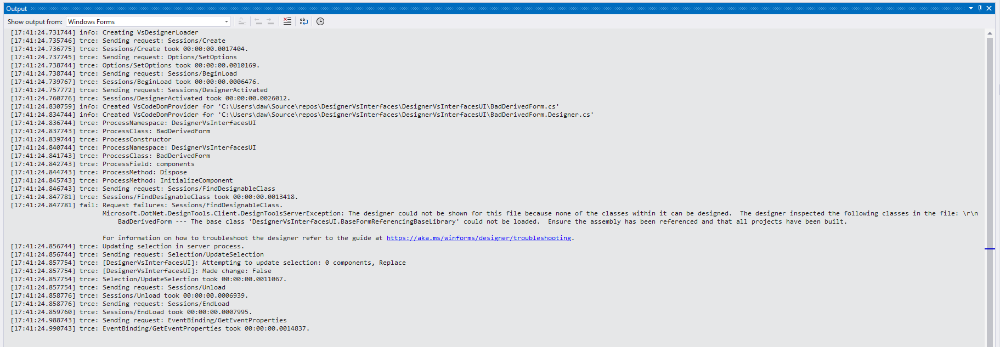
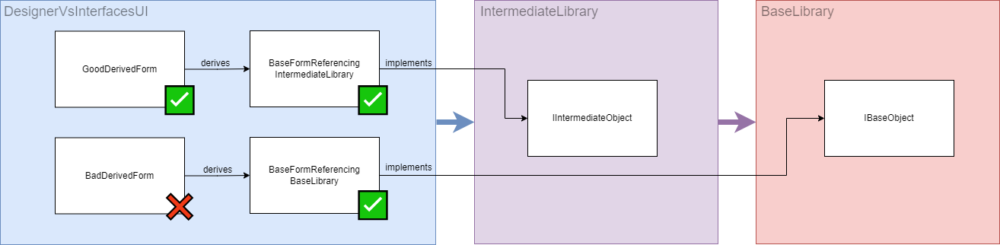
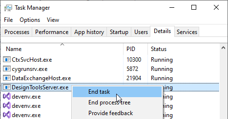

#  .NET 6 WinForms Designer Bug

The new [out-of-process Windows Forms designer](https://devblogs.microsoft.com/dotnet/state-of-the-windows-forms-designer-for-net-applications/) shows the following error in a specific constellation which this repository is trying to demonstrate:

It took me quite a while to hunt this down but it seems that the new designer shows this error if ...
 - the form in question is derived from a base form (from the same or another project)
 - the base form implements an interface
 - the interface is implemented in another project 
 - the other project is **referenced over an transient project reference**

 In this case the base form still can be designed. The designer however crashes when openening the derived form. The error disappears as soon a direct project reference is added.

### The diagram below highlights the setup

 - DesignerVsInterfacesUi references IntermediateLib directly
 - DesignerVsInterfacesUi references BaseLibrary implicitly via the reference from IntermediateLib to BaseLibrary
 - ✅ Designer is working
 - ❌ Designer is not working

### A word about designer testing

Anytime references or interface implementations are changed, the following steps are necessary to verify whether or not the designer is working:

 - Close all tabs
 - Rebuild solution
 - Kill the designer process `DesignToolsServer.exe`
 - Open the designer

 
